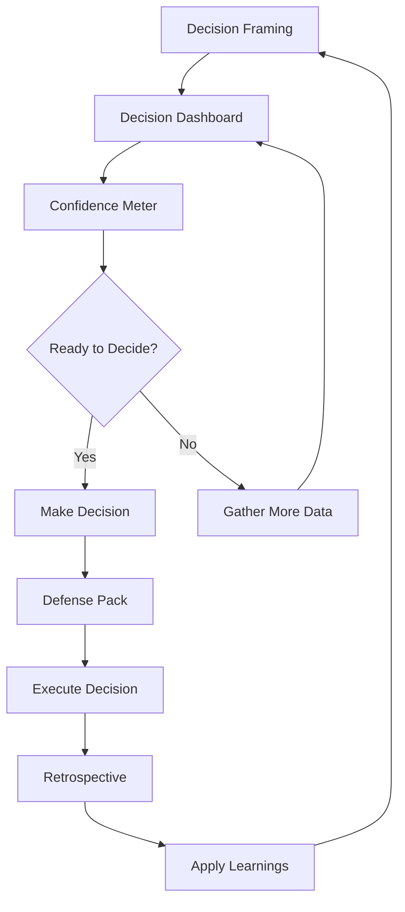

# Product Playground - Feature Summary

**Version 2.0 - Decision Support System**  
**Last Updated:** January 28, 2026

---

## 🎯 Complete Feature Set: 9 Tools

### Core Analysis Tools (3)

| Feature | Purpose | Key Output |
|---------|---------|------------|
| 💡 **Product Challenge Analysis** | Navigate complex product decisions | Strategic recommendations with tradeoffs |
| 📈 **Dashboard KPI Diagnostics** | Analyze 8 core product metrics | Health assessment with action plan |
| 🔍 **Product Teardown** | Analyze competitors from URL | Market positioning & strategic insights |

### Decision Support System (5)

| Feature | Purpose | Key Output |
|---------|---------|------------|
| 🎯 **Decision Framing Engine** | Clarify what's being decided | Refined decision statement & frame |
| 📊 **Decision Dashboard** | Form competing hypotheses | 3-5 hypotheses with testing plans |
| ⚡ **Confidence Meter** | Assess signal strength | Strong/Emerging/Weak assessment |
| 🛡️ **Decision Defense Pack** | Communicate to stakeholders | Executive-ready brief |
| 🔄 **Decision Retrospective** | Learn from past decisions | Patterns & guidance for next time |

### Guided Experience (1)

| Feature | Purpose | Key Output |
|---------|---------|------------|
| 🧭 **Guided Walkthrough** | 5-step structured framework | Complete analysis with steps |

---

## 🔄 Decision Support Flow



---

## 📥 PDF Export

**All 9 features** generate professional PDFs:
- Executive-ready formatting
- Branded headers/footers
- Downloadable from every analysis
- Shareable with stakeholders

---

## 🎨 User Experience

### Landing Page
- 9 feature cards in grid layout
- Glass morphism design
- Purple-blue gradient theme
- One-click navigation to any tool

### Application Interface
- Tabbed interface for all features
- Real-time AI analysis
- Form validation
- Success/error alerts
- Loading states with spinners

---

## 🧠 AI Philosophy

**What the AI Does:**
- ✅ Illuminates possibilities
- ✅ Forms competing hypotheses
- ✅ Assesses qualitatively
- ✅ Builds on your thinking
- ✅ Acknowledges uncertainty

**What the AI Doesn't Do:**
- ❌ Make decisions for you
- ❌ Claim certainty
- ❌ Rank options definitively
- ❌ Use false precision (percentages)
- ❌ Replace human judgment

---

## 📊 Technical Stack

- **Backend:** Flask 3.0+ (Python)
- **AI:** OpenAI GPT-4o
- **PDF:** ReportLab
- **Frontend:** Vanilla JS, HTML5, CSS3
- **Fonts:** Inter + Playfair Display
- **Deployment:** PythonAnywhere / Render

---

## 🚀 Getting Started

```bash
# 1. Clone
git clone https://github.com/anubhav-product/ProductPlayGround.git
cd ProductPlayGround/product-thinking-studio

# 2. Setup
python3 -m venv venv
source venv/bin/activate
pip install -r requirements.txt

# 3. Configure
cp .env.example .env
# Add OPENAI_API_KEY

# 4. Run
python flask_app.py

# 5. Open
http://localhost:5000
```

---

## 📈 Use Cases

### For Product Managers
- Frame decisions before analyzing
- Assess confidence before committing
- Defend decisions to stakeholders
- Learn from outcomes

### For Product Leaders
- Review team proposals
- Set decision-making standards
- Prepare executive presentations
- Build team decision muscle

### For Startups
- Make critical decisions with limited resources
- Validate before committing scarce resources
- Prepare investor-ready materials
- Build institutional knowledge

---

## 💡 Decision Support Principles

1. **Frame Before Analyzing** - Clarify what you're deciding
2. **Hypotheses Over Conclusions** - Consider multiple explanations
3. **Qualitative Confidence** - Avoid false precision
4. **Support Judgment** - AI illuminates, you decide
5. **Learn From Outcomes** - Review to improve

---

## 📚 Documentation

- `README.md` - Complete setup & features
- `PRD.md` - Product requirements & specifications
- `PROJECT-SUMMARY.md` - Project overview
- `PYTHONANYWHERE-DEPLOY.md` - Deployment guide
- `FEATURE-SUMMARY.md` - This document

---

**Made with ❤️ for Product Managers**
